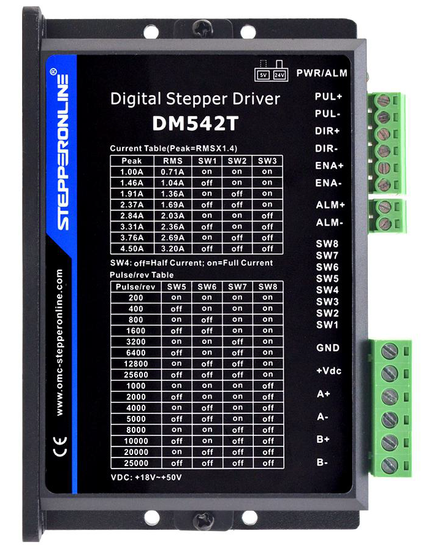
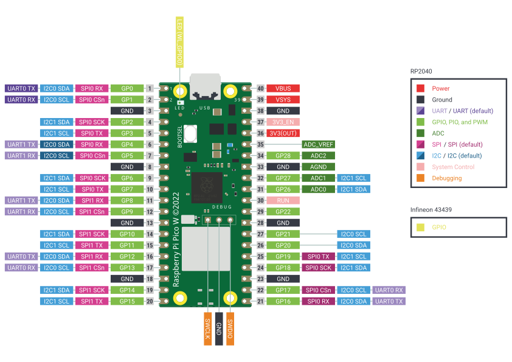
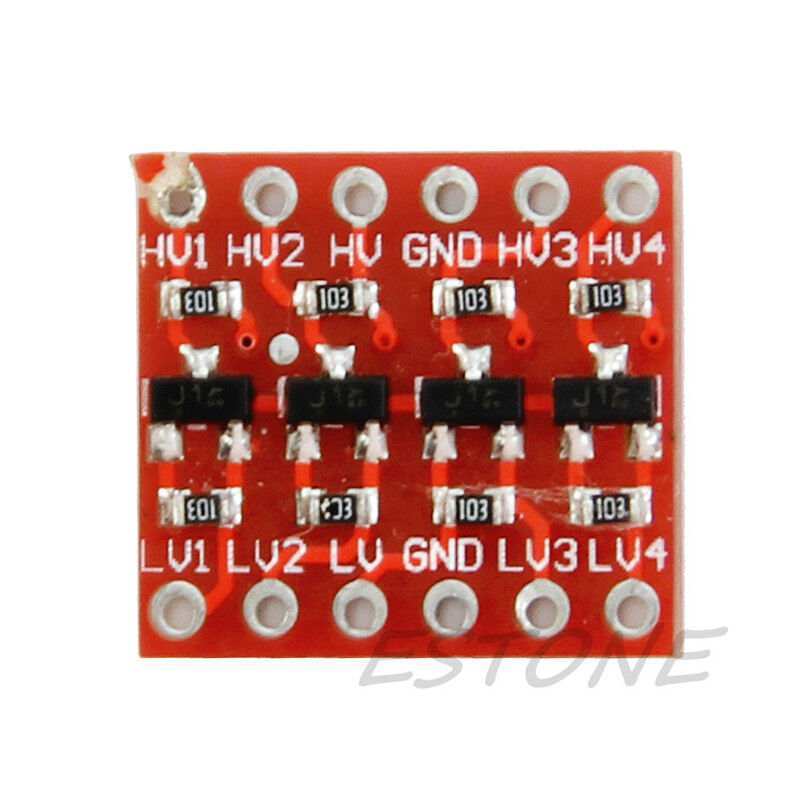

# YardControl

Small project for a 'Shuttle Yard' control using a linear actuator with a stepper motor driver using an Raspberry Pi Pico W.

Supports WiFi providing a Telnet commandline interface, a web interface and REST web api setup for testing the application.

License: [MIT](LICENSE)

## Hardware

### NEMA Stepper Motor
The stepper motor is a typical NEMA 23 motor with the following characteristics:
~~~ txt
      Step Angle:     1.8° (200 steps per revolution)
      Max. PRM:       600
      Phases:         2
      Rotor Inertia:  280 g/cm²
      Mass:           0.72 kg
      Rated Voltage:  3 V - 36 V
      Rated Current:  2.8 A
      Holding Torque: 1.26 Nm
      Detent Torque:  45 mNm
~~~

With higher frequency the usable torque is decreased considerably.

### Stepper Motor Driver
The stepper motor driver used is a DM542T and allows microstepping up to 128.
The DM542T (V4.0) is designed to operate within 18 - 50VDC voltage input.
The minimum pulse width is 2.5 μs.

The DM542T(V4.0) has one 8-bit DIP switch and one 1-bit selector. The first 8-bit is used to configure settings of micro
step resolution, output current, motor standstill current, pulse type and smoothing time as shown below.

~~~
|  SW1  |  SW2  |  SW3  |  SW4  |  SW5  |  SW6  |  SW7  |  SW8  |

     Output Current       Idle              Microstep
                         Current
~~~
Microstep resolution is set by SW5, 6, 7, 8 of the DIP switches as shown in the following table.

| Microsteps | Steps/rev. | SW5 | SW6 | SW7 | SW8 |
|------------|------------|-----|-----|-----|-----|
| 1          | 200        | ON  | ON  | ON  | ON  |
| 2          | 400        | OFF | ON  | ON  | ON  |
| 4          | 800        | ON  | OFF | ON  | ON  |
| 8          | 1600       | OFF | OFF | ON  | ON  |
| 16         | 3200       | ON  | ON  | OFF | ON  |
| 32         | 6400       | OFF | ON  | OFF | ON  |
| 64         | 12800      | ON  | OFF | OFF | ON  |
| 128        | 25600      | OFF | OFF | OFF | ON  |
| 5          | 1000       | ON  | ON  | ON  | OFF |
| 10         | 2000       | OFF | ON  | ON  | OFF |
| 20         | 4000       | ON  | OFF | ON  | OFF |
| 25         | 5000       | OFF | OFF | ON  | OFF |
| 40         | 8000       | ON  | ON  | OFF | OFF |
| 50         | 10000      | OFF | ON  | OFF | OFF |
| 100        | 20000      | ON  | OFF | OFF | OFF |
| 125        | 25000      | OFF | OFF | OFF | OFF |

##### Output Current Configurations
The first three bits (SW1, 2, 3) of the DIP switch are used to set the dynamic current.

| Peak Current | RMS Current | SW1 | SW2 | SW3 |
|--------------|-------------|-----|-----|-----|
|    1.00A     |    0.71A    | ON  | ON  | ON  |
|    1.46A     |    1.04A    | OFF | ON  | ON  |
|    1.91A     |    1.36A    | ON  | OFF | ON  |
|    2.37A     |    1.69A    | OFF | OFF | ON  |
|    2.84A     |    2.03A    | ON  | ON  | OFF |
|    3.31A     |    2.36A    | OFF | ON  | OFF |
|    3.76A     |    2.69A    | ON  | OFF | OFF |
|    4.50A     |    3.20A    | OFF | OFF | OFF |

#### **Features**
- Step & direction (PUL/DIR) control
- Input voltage 20-50VDC (recommended 24-48VDC)
- 200 KHz max pulse input frequency
- 16 microstep resolutions of 200-25,600 via DIP switches
- 8 output current settings of 1.0-4.5A via DIP Switches
- Idle current reduction to 50% or 90% selection via SW4
- Auto-tuning to match wide-range NEMA 11, 17, 23 and 24 stepper motors
- Anti-Resonance for optimal torque, extra smooth motion, low motor heating and noise
- Soft-start with no “jump” when powered on
- Optically isolated inputs with 5V or 24V
- Fault output
- Over-voltage and over-current protections

#### **Electrical Specification**

|             |                           |
|-------------|---------------------------|
| Input       | Current 0~5.0A            |
| Output      | Current 0.5-4.0A          |
| Power (MAX) | 160W                      |
| Micro Step  | 1, 2/A, 2/B, 4, 8, 16, 32 |
| Temperature | -10~45 °C                 |
| Humidity    | No Condensation           |
| Weight      | 0.2 kg                    |
| Dimension   | 96*56*33 mm               |

#### **Input / Output**

**Signal Input**
~~~ txt
    PUL+    Pulse +
    PUL-    Pulse - 
    DIR+    Direction +
    DIR-    Direction - 
    EN+     Off-line Control Enable +
    EN-     Off-line Control Enable - 
~~~
**Signal Output**
~~~ txt
    ALM+    Fault output +
    ALM-    Fault output -
~~~
**Motor Machine Winding**
~~~ txt
    A+ Stepper motor A+
    A- Stepper motor A-
    B+ Stepper motor B+
    B- Stepper motor B-
~~~
**Power Supply**
~~~ txt
    VCC     VCC (DC9-42V)
    GND     GND
~~~

When over voltage or over current protection happens, DM542T(V4.0) red status LED light will blink and the
impedance state between ALM+ and ALM- will change (from low to high or high to low depending on configuration)
Note that the ENA input pin of the DM542T is inverted (enabled = LOW) and is optional (connect the ENA input pin to ground).

###  Pico W
The Raspberry Pi Pico W is a microcontroller board based on the Raspberry Pi RP2040 microcontroller chip
and has been designed to be a low cost yet flexible development platform for RP2040, with a 2.4GHz
wireless interface and the following key features:

- RP2040 microcontroller with 2MB of flash memory
- On-board single-band 2.4GHz wireless interfaces (802.11n)
- Micro USB B port for power and data (and for reprogramming the flash)
- Exposes 26 multi-function 3.3V general purpose I/O (GPIO)
- 23 GPIO are digital-only, with three also being ADC capable
- Can be surface-mounted as a module
- Dual-core cortex M0+ at up to 133MHz
- On-chip PLL allows variable core frequency
- 264kB multi-bank high performance SRAM
- On-board USB1.1 (device or host)
- 30 multi-function general purpose I/O (four can be used for ADC)
- 12-bit 500ksps analogue to digital converter (ADC)

### Logic Level Shifter
Since the Raspberry Pi Pico W GPIO support 3.3V and 
the TB6600 motor driver provides 5V inputs, the TXS0108 logic level shifter is used.

#### **Features**
- Bi-directional
- Automatic direction control
- 1.2 Mbps (open drain)
- Low voltage 1.4 to 3.6 V
- High voltage 1.65 to 5.5 V
- Dimensions: 15 mm x 13 mm

# Development

##   Arduino
Arduino is an open-source hardware and software company, project, and user community that designs and manufactures single-board microcontrollers and microcontroller kits for building digital devices.

The microcontrollers can be programmed using the C and C++ programming languages, using a standard API which is also known as the Arduino Programming Language, inspired by the Processing language and used with a modified version of the Processing IDE.

Support of the Raspberry Pi Pico W is available via the Raspberry Pi Pico Arduino core, Arduino-Pico and can be found at Github (https://github.com/earlephilhower/arduino-pico).

## Additional Libraries
Additional libraries are used. They can be found and installed via the Arduino library manager.

- AccelStepperWithDistance
- AccelStepper
- TelnetLib
- WebServer
- LittelFS
- Blinkenlight
- StringSplitter
- ArduinoTrace

## Local Modules
The local modules implement the application settings (read from a JSON file), support for blinking leds, system info, wireless connection, and a command interpreter.

- PicoW.h
- Version.h
- GpioPins.h, GpioPins.cpp
- Actuator.h, Actuator.cpp
- Commands.h, Commands.cpp
- ServerInfo.h, ServerInfo.cpp
- AppSettings.h, AppSettings.cpp
- ActuatorInfo.h, ActuatorInfo.cpp
- SystemInfo.h, SystemInfo.cpp
- WiFiInfo.h, WiFiInfo.cpp
- Wireless.h, Wireless.cpp
- appsettings.json

### YardControl.ino
The main module gets the settings, connects to an wlan access point, creates the commands, the web server and the telnet server.

1. Create (global) instances.
    1. Create the onboard led instance.
    2. Create the application settings.
    3. Create the input and output pins.
    4. Create the actuator instance.
    5. Instanciates the web server (on port 80).
    6. Instanciates the telnet server.
    7. Create the commands instance.
    8. Instanciates the global timer.
2. Run the setup() function.
   1. Start the Serial interface (USB).
   2. Initialize the LittleFS file system.
   3. Initialize the Settings (appsettings.json).
   4. Initializes the GPIO outputs and inputs.
   5. Initialize the actuator instance.
   6. Connect to a wlan access point.
      1. If not successful create local AP.
      2. If local AP cannot be creates, stop.
   7. Get UTC time using NTP.
   8. Setup the HTTP requests.
   9. Start the web server.
   10. Setup the telnet callbacks.
   11. Start the telnet server.
   12. Initialize the global timer.
3. Enter loop().
    1.  Update Led.
    2.  Update Inputs.
    3.  Update Telnet.
    4.  Update Http Server.

### Commands
This class maintain lists of available commands. A command is a class holding the name, an optional shortcut, and a command function pointer (callback).

The following command types are supported:
~~~ txt
     BaseCommand - A command with an optional shortcut and no arguments.
     LongCommand - A command with an optional shortcut and a single long argument.
     FloatCommand - A command with an optional shortcut and a single float argument.
~~~
Public Fields:
~~~ txt
    JsonOutput      - Flag indicating JSON output (telnet).
    VerboseOutput   - Flag indicating verbose serial output.
    WaitForResponse - Flag indicating that we wait for a (Yes/No) response.
~~~
Public Methods:
~~~ txt
    init()     - Initializes the command list.
    add()      - Creates a new command and adds to the command list.
    run()      - Parses the input line and runs the command.
    help()     - Gets a printable help string on the available commands.
~~~

### InfoClasses
The follwing info classes are implemented

- ServerInfo
- ActuatorInfo
- SystemInfo
- WiFiInfo
- GpioPins

The all provide public fields, initialized in the cunstructor, with various information.

### Settings
All application settings are maintained here. The settings classses provided are all instantiated reading the application settings file 'appsettings.json'.
- Yard Settings
- Actuator Settings
- Stepper Settings
- Server Settings
- Http -Settings
- Telnet Settings
- WiFi Settings
- AP Settings

### appsettings.json
~~~ JSON
{
    "Yard": {
        "Tracks": [
            1600,
            68800,
            121600,
            174400,
            227200,
            280000,
            332800,
            385600,
            438400,
            491200
        ]
    },
    "Actuator": {
        "LedRunning": 3,
        "LedInLimit": 4,
        "LedAlarmOn": 5,
        "SwitchStop": 7,
        "SwitchLimit1": 8,
        "SwitchLimit2": 9,
        "MoveSpeed": 1000.0,
        "Retract": 3200
    },
    "Stepper": {
        "PinPUL": 0,
        "PinDIR": 1,
        "PinENA": 2,
        "PinALM": 6,
        "MicroSteps": 16,
        "MaxSpeed": 2000.0,
        "Acceleration": 300.0,
        "StepsPerRotation": 200,
        "DistancePerRotation": 2.0,
        "MinPulseWidth": 20
    },
    "Http": {
        "Port": 80
    },
    "Telnet": {
        "Port": 23,
        "Prompt": ">"
    },
    "WiFi": {
        "DHCP": true,
        "SSID": "<SSID>",
        "Password": "<Password>",
        "Hostname": "<Hostname>",
        "Address": "<IP-Adress>",
        "Gateway": "<IP-Adress>",
        "Subnet": "255.255.255.0",
        "DNS": "<IP-Adress>"
    },
    "AP": {
        "SSID": "YARD_CONTROL",
        "Password": "<Password>",
        "Hostname": "<Hostname>"
    }
~~~

### Telnet Commands
The TelnetLib has been updated to support the delete key (sending a '*space*' and '*backspace*' when receiveing a '*backspace*').

A set of commands are available at the telnet prompt. The '*help*' command provides a list of all supported commands:

~~~ txt
Yard Control:
Allows to control the linear actuator providing a set of commands.

The following commands with no argument are available:

    + | plus      - Moves a step forward.
    - | minus     - Moves a step backward.
    ? | help      - Shows this help information.
    b | backward  - Moves a 0.1 mm distance backward.
    c | calibrate - Run a calibration sequence.
    d | disable   - Stops the motor by disabling the output.
    e | enable    - Enabling the output (after disable).
    f | forward   - Moves a 0.1 mm distance forward.
    g | gpio      - Shows the GPIO input and output pin values.
    h | home      - Moves to home position (position = 0).
    j | json      - Toggle JSON output.
    p | position  - Shows the current position.
    q | quit      - Terminates the program.
    s | status    - Shows the current state of the motor driver.
    r | release   - Release the stopped motor.
    x | stop      - Stops the running motor.

    acceleration - Gets the acceleration (steps/(sec*sec)).
    maxspeed     - Gets the maximum speed (steps/sec).
    speed        - Gets the current speed (steps/(sec*sec)).
    reset        - Resets the current positio to zero.
    reboot       - Reboots the RP2040.
    server       - Shows the server information.
    settings     - Shows the settings information.
    system       - Shows the system information.
    verbose      - Toggle verbose Serial output.
    wifi         - Shows the WiFi information.

The following commands require an argument:

    s | step   <integer> - Moves the number of steps (relative).
    m | stepto <integer> - Moves to absolute position (steps).
    t | track  <integer> - Moves to track number.
    r | move   <number>  - Moves the number of mm (relative).
    a | moveto <number>  - Moves to absolute position (mm).

    acceleration <number>  - Sets the acceleration (steps/(sec*sec)).
    maxspeed     <number>  - Sets the maximum speed. (steps/sec).
    speed        <number>  - Sets the current speed. (steps/sec).
~~~

### Web Pages
A set of web pages are available to current stepper status, system info and settings. The home page allows to control the stpper motor using the REST api provided.
All HTML pages use `Bootstrap 5` (CSS and JS) files for the display. Those files are provided by https://cdn.jsdelivr.net/npm/bootstrap@5.2.3/dist.
Also an extension to Bootstrap to switch between light and dark theme is used (see https://github.com/coliff/dark-mode-switch).

| Path                            | Description                                               |
|---------------------------------|-----------------------------------------------------------|
| www/index.html                  | Returns the main (default) page.                          |
| www/info.html                   | Displays the system settings (hardware and network info). |
| www/settings.html               | Displays the application settings.                        |
| www/about.html                  | A short description of the application and the REST api.  |
|                                 |                                                           |
| www/favicon.ico                 | File containing the shortcut icons.                       | 
| www/css/dark-mode-switch.css    | Bootstrap light switch support.                           |
| www/js/dark-mode-switch.mini.js | Script for Bootstrap light switch support.                |

The web server is used to implement the web interface for the stepper test app. The REST based API is used by the web pages to request settings, current data, and system information. The GET requests can also be used to integrate the sensors into other applications. All provided REST requests returns data in JSON format.

### REST API's
The following list summarizes the conventions adopted by the RESTful implementation.

   - GET&nbsp;&ensp;&ensp;&emsp;Retrieves the current status, information, or settings.
   - PUT&nbsp;&ensp;&ensp;&emsp;Modifies some data (speed, position, etc.).
   - POST&nbsp;&ensp;&emsp;Updates settings or execute commands.
   - DELETE&emsp;Not used.

| GET Request       | Description                                           |
|-------------------|-------------------------------------------------------|
| /appsettings.json | Downloads the content of the *appsettings.json* file. |
| /settings         | Returns the complete application settings.            |
| /system           | Returns a set of system information data.             |
| /server           | The server settings (Http, Telnet).                   |
| /status           | The current stepper state (position, speed etc.).     |
| /wifi             | The status of the wifi connection (SSID, RSSI etc.).  |
| /gpio             | The status of the used GPIO pins                      | 

| POST Request      | Description                                           |
|-------------------|-------------------------------------------------------|
| /appsettings.json | Uploads an *appsettings.json* file.                   |
| /plus	            | Move a single step forward.                           |
| /minus	        | Move a single step backward.                          |
| /forward	        | Move a small step (0.1) forward.                      |
| /backward	        | Move a small step (0.1) backward.                     |
| /calibrate	    | Initiates a calibration routine.                      |
| /enable	        | Enables the stepper motor.                            |
| /disable	        | Disables the stepper motor.                           |
| /home	            | Move ro the home position.                            |
| /stop	            | Stops the stepper motor.                              |
| /release          | Relase the stopped motor.                             |
| /reboot	        | Reboots the machine.                                  |

| PUT Request       | Description                                           |
|-------------------|-------------------------------------------------------|
| /step	            | Move the number of steps (relative).                  |
| /move	            | Move the number of mm (relative).                     |
| /stepto	        | Move to absolute position (steps).                    |
| /moveto	        | Move to absolute position (mm).                       |
| /speed	        | Sets the maximum speed (steps per second).            |
| /maxspeed	        | Sets the maximum speed (steps per second).            |
| /acceleration	    | Sets the acceleration (steps per second per second).  |

### GPIO Mapping
The Raspberry Pi Pico W and the GPIO pins (output from 'pico' command).
~~~ Text
[UART0 TX][I2C0 SDA][SPIO0 RX ][   GP0  ] [01] +--|   |--+ [40] [  VBUS  ]                               
[UART0 RX][I2C0 SCL][SPIO0 CSn][   GP1  ] [02] |  |___|  | [39] [  VSYS  ]                               
                               [   GND  ] [03] |         | [38] [  GND   ]                               
          [I2C1 SDA][SPIO0 SCK][   GP2  ] [04] |         | [37] [ 3V3_EN ]                               
          [I2C1 SCL][SPIO0 TX ][   GP3  ] [05] |         | [36] [3V3(OUT)]                               
[UART1 TX][I2C0 SDA][SPIO0 RX ][   GP4  ] [06] |         | [35]           [ADC_VREF ]                    
[UART1 RX][I2C0 SCL][SPIO0 CSn][   GP5  ] [07] |         | [34] [  GP28  ][  ADC2   ]                    
                               [   GND  ] [08] |         | [33] [  GND   ][  AGND   ]                    
          [I2C1 SDA][SPIO0 SCK][   GP6  ] [09] |         | [32] [  GP27  ][  ADC1   ][I2C1 SCL]          
          [I2C1 SCL][SPIO0 TX ][   GP7  ] [10] |         | [31] [  GP36  ][  ADC2   ][I2C1 SDA]          
[UART1 TX][I2C0 SDA][SPIO1 RX ][   GP8  ] [11] |         | [30] [  RUN   ]                               
[UART1 RX][I2C0 SCL][SPIO1 CSn][   GP9  ] [12] |         | [29] [  GP22  ]                               
                               [   GND  ] [13] |         | [28] [  GND   ]                               
          [I2C1 SDA][SPIO1 SCK][   GP10 ] [14] |         | [27] [  GP21  ]           [I2C0 SCL]          
          [I2C1 SCL][SPIO1 TX ][   GP11 ] [15] |         | [26] [  GP20  ]           [I2C0 SDA]          
[UART0 TX][I2C0 SDA][SPIO1 RX ][   GP12 ] [16] |         | [25] [  GP19  ][SPIO0 TX ][I2C1 SCL]          
[UART0 RX][I2C0 SCL][SPIO1 CSn][   GP13 ] [17] |         | [24] [  GP18  ][SPIO0 SCK][I2C1 SDA]          
                               [   GND  ] [18] |         | [23] [  GND   ]                               
          [I2C1 SDA][SPIO1 SCK][   GP14 ] [19] |         | [22] [  GP17  ][SPIO0 CSn][I2C0 SCL][UART0 RX]
          [I2C1 SCL][SPIO1 TX ][   GP15 ] [20] |_________| [21] [  GP16  ][SPIO0 RX ][I2C0 SDA][UART0 TX]
~~~

#### GPIO Used Pins

~~~
[ OUTPUT ][  PUL  ][   GP0  ] [01] +--|   |--+ [40] [  VBUS  ]
[ OUTPUT ][  DIR  ][   GP1  ] [02] |  |___|  | [39] [  VSYS  ]
                   [   GND  ] [03] |         | [38] [  GND   ]
[ OUTPUT ][  ENA  ][   GP2  ] [04] |         | [37] [ 3V3_EN ]
[ OUTPUT ][ Led 1 ][   GP3  ] [05] |         | [36] [3V3(OUT)]
[ OUTPUT ][ Led 2 ][   GP4  ] [06] |         | [35] [ADC_VREF]          
[ OUTPUT ][ Led 3 ][   GP5  ] [07] |         | [34] [  GP28  ]
                   [   GND  ] [08] |         | [33] [  GND   ]
[ INPUT  ][  SW 1 ][   GP6  ] [09] |         | [32] [  GP27  ]
[ INPUT  ][  SW 2 ][   GP7  ] [10] |         | [31] [  GP36  ]
[ INPUT  ][  SW 3 ][   GP8  ] [11] |         | [30] [  RUN   ]
                   [   GP9  ] [12] |         | [29] [  GP22  ]
                   [   GND  ] [13] |         | [28] [  GND   ]
                   [   GP10 ] [14] |         | [27] [  GP21  ]
                   [   GP11 ] [15] |         | [26] [  GP20  ]
                   [   GP12 ] [16] |         | [25] [  GP19  ]
                   [   GP13 ] [17] |         | [24] [  GP18  ]
                   [   GND  ] [18] |         | [23] [  GND   ]
                   [   GP14 ] [19] |         | [22] [  GP17  ]
                   [   GP15 ] [20] |_________| [21] [  GP16  ]
~~~
#### Stepper Driver Control
A global periodic timer running at 100 kHz is used to generate pulses for the stepper motor driver unit.
The timer callback function is therefore called 100000 times a second, or every 10 microseconds.

An internal step counter is used to keep track of the required steps to reach a specified target.
A second internal counter is used to determine the delay between pulses (steps) depending on the specified speed.
The pulsewidth is fixed at 10 microseconds (the output is set high at the first call, and set low at the second call).
The second counter is increased until the number of required calls (number of intervals) is reached.

~~~
|   1  |   2  |   3  |   4  |        |   n  |       Number of intervals (n)
| 10us | 10us | 10us | 10us |        | 10us |       10 us intervals
|------|------|------|------|........|------|
| PUL+
 ______
|      |
|      |_____________________........_______|       One output pulse (every n*10 us)

|<---->|<--------------------........------>|       
| 10us |           (n - 1)*10 us            |       Total time n*10 us
~~~

When the speed is specified in steps per second, the number of required 10 us intervals is dermined as follows:
~~~
 _               _               _               _              
| |_____________| |_____________| |___......____| |_____________

number of intervals = 100 kHz / (steps per second)
~~~
Since the number of intervals has to be an integer number, the set speed will be only approximately correct.
However, the stepper driver is moving for the required number of steps with the set speed.
The maximum speed is a delay of 10 us (2 intervals) resulting in a 20 us period or 50 kHz.

For a typical stepper motor driver with 200 steps per revolution and a linear actuator with a lead screw providing 2 mm travel distance per revolution, this results in 100 steps per mm.
When microstepping is used, the number of steps / mm is increased acordingly. The attainable speed for a stepper motor is in the range of 1000 rpm.
With higher speed, the torque is considerable decreased, and the motor has to ramp up the speed slowly.
Assuming a maximum frequency of 50 kHz, the resulting maximum RPM is as follows:

~~~
2.00    mm per rotation
200     steps per rotation
100000  timer frequency (100 kHz)
50000   max steps per second (2 cycles)

(steps/rotation) = microsteps*(steps/rotation)
(max rpm)        = 60*(max steps/second)/(steps/rotation)
(mm/sec)         = (distance/rotation)*(max rpm)/60
(mm/min)         = (max rpm)/(distance/rotation)
(steps/mm)       = (steps/rotation)/(distance/rotation)
~~~
| microsteps  | steps/rotation |   max rpm   |   mm/sec  |  mm/min   |  steps/mm  |
|-------------|----------------|-------------|-----------|---------- |------------|
|      1	  |      200	   |  15000.0000 | 500.00000 | 7500.000  |     100    |
|      2	  |      400	   |   7500.0000 | 250.00000 | 3750.000  |     200    |
|      4	  |      800	   |   3750.0000 | 125.00000 | 1875.000  |     400    |
|      5	  |      1000	   |   3000.0000 | 100.00000 | 1500.000  |     500    |
|      8	  |      1600	   |   1875.0000 | 62.50000  | 937.5000  |     800    |
|      10	  |      2000	   |   1500.0000 | 50.00000  | 750.0000  |    1000    |
|      **16**	  |      **3200**	   |   **937.5000**  |   **31.2500** | **468.7500**  |    **1600**    |
|      20	  |      4000	   |    750.0000 | 25.00000  | 375.0000  |    2000    |
|      25	  |      5000	   |    600.0000 | 20.00000  | 300.0000  |    2500    |
|      32	  |      6400	   |    468.7500 | 15.62500  | 234.3750  |    3200    |
|      40	  |      8000	   |    375.0000 | 12.50000  | 187.5000  |    4000    |
|      50	  |      10000	   |    300.0000 | 10.00000  | 150.0000  |    5000    |
|      64	  |      12800	   |    234.3750 |  7.81250  | 117.1875  |    6400    |
|      100	  |      20000	   |    150.0000 |  5.00000  | 75.00000  |   10000    |
|      125	  |      25000	   |    120.0000 |  4.00000  | 60.00000  |   12500    |
|      128	  |      25600	   |    117.1875 |  3.90625  | 58.59375  |   12800    |

With 16 microsteps the speed and intervals can be calculated as:

~~~
rpm       = 60*(steps/sec)/((steps/rotation)*microsteps)
(mm/sec)  = (distance/rotation)*rpm/60
intervals = INT(timer frequency/(steps/sec))
speed     = (timer frequency)/intervals
~~~
| steps/sec |    rpm    |   mm/sec  | intervals	| speed  |
|-----------|-----------|-----------|-----------|--------|
|    1	    |   0.01875	|  0.000625	| 100000	| 1      |
|    10	    |   0.18750	|  0.006250	|  10000	| 10     |
|    25	    |   0.46875	|  0.015625	|   4000	| 25     |
|    50	    |   0.93750	|  0.031250	|   2000	| 50     |
|    75	    |   1.40625	|  0.046875	|   1333	| 75     |
|    100	|   1.87500	|  0.062500	|   1000	| 100    |
|    250	|   4.68750	|  0.156250	|    400	| 250    |
|    500	|   9.37500	|  0.312500	|    200	| 500    |
|    750	|  14.06250	|  0.468750	|    133	| 752    |
|    1000	|  18.75000	|  0.625000	|    100	| 1000   |
|    2500	|  46.87500	|  1.562500	|     40	| 2500   |
|    5000	|  93.75000	|  3.125000	|     20	| 5000   |
|    7500	| 140.62500	|  4.687500	|     13	| 7692   |
|    10000	| 187.50000	|  6.250000	|     10	| 10000  |
|    25000	| 468.75000	| 15.625000 | 	   4	| 25000  |
|    50000	| 937.50000	| 31.250000 | 	   2	| 50000  |

The total number of (10 us) intervals is stored in an integer variable.
The maximum number (32 bit integer) is 2147483647 resulting in a maximum period of 21474836470 us () or ca. 6 hours.
The minimum speed is therefore ca. 4 steps per day.

